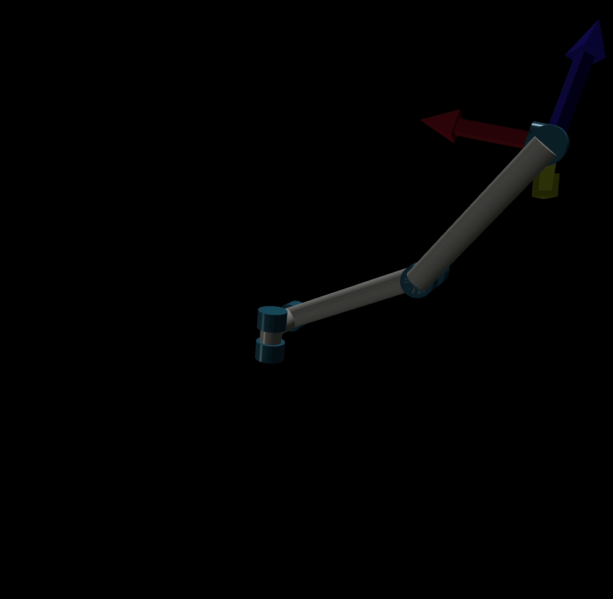

## Modern Robotics

Examples from [Modern Robotics](http://hades.mech.northwestern.edu/index.php/Modern_Robotics), Lynch and Park

Written in Pytorch by Duane Nielsen



# install and run tests

```
git clone https://github.com/DuaneNielsen/modern_robotics.git
cd modern_robotics
python3 -n venv ./venv
source ./venv/bin/activate
pip install -e .[dev]
pytest
```

